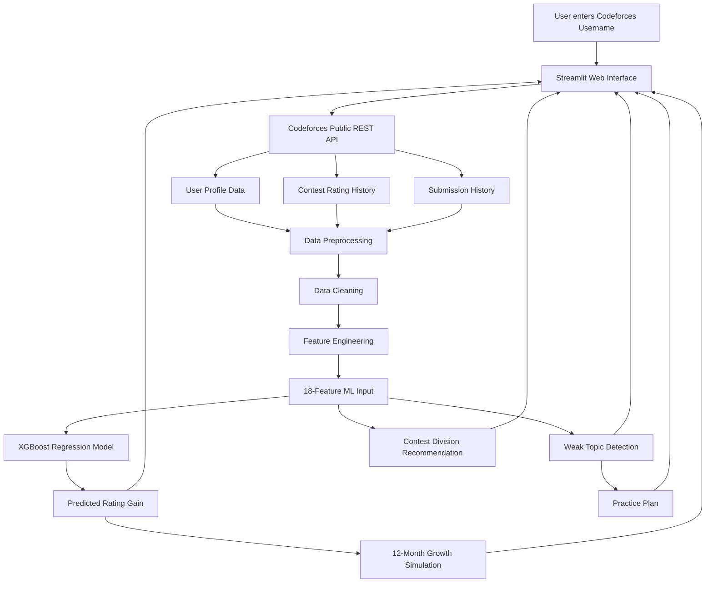
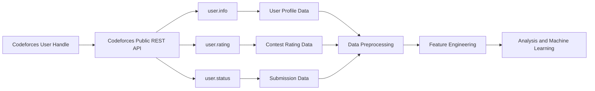

# Test-Orbit_Integrated-Smart_Education

### From Data to Success: Code-Forces Analyzer for Performance Enhancement

> A machine-learning-powered competitive programming analytics and coaching system that transforms Codeforces activity into rating predictions, weak-topic detection, growth simulation, and personalized practice recommendations.

---

## Overview

**Codeforces AI Coach** is a Data Science and Machine Learning project built to analyze competitive programming behavior and convert raw Codeforces activity into actionable coaching intelligence.

Unlike a traditional Codeforces profile analyzer that only displays static statistics such as rating, rank, contests, and solved problems, this system studies recent behavioral patterns and uses **XGBoost** to estimate a user's short-term rating progression.

The system combines:

- Real-time Codeforces API data
- 60-day behavioral analysis
- Problem-solving activity
- Problem difficulty patterns
- Topic/tag distributions
- Contest performance trends
- Feature engineering
- XGBoost regression
- Weak-topic detection
- Personalized practice planning
- 12-month growth simulation
- Contest division recommendations
- Interactive Streamlit visualization

The final system is designed as an **AI-assisted competitive programming coach**, rather than merely a profile statistics dashboard.

---

# Key Highlights

| Capability | Description |
|---|---|
| Real-Time Data | Fetches current Codeforces data through public REST APIs |
| Behavioral Analysis | Studies recent problem-solving and contest behavior |
| Feature Engineering | Converts raw activity into engineered behavioral features |
| ML Prediction | Uses XGBoost to predict short-term rating change |
| Target Smoothing | Predicts average rating change across the next 3 contests |
| Weak Topic Detection | Identifies topics requiring additional practice |
| Practice Planning | Generates recommended problem counts and estimated hours |
| Growth Simulation | Projects a 12-month rating trajectory |
| Contest Strategy | Recommends an appropriate Codeforces division |
| Interactive UI | Streamlit-based web interface |
| Scalable Data Pipeline | Uses parallel API fetching with ThreadPoolExecutor |

---

# Project Evolution

The project originally started as a **Codeforces Profile Analyzer** focused on static visualization and two-user comparison.

It was subsequently upgraded into a complete **Codeforces AI Coach**.

| Review-I | Final System |
|---|---|
| Static profile analysis | Dynamic ML-based prediction |
| Two-user comparison | Individual AI coaching |
| Tag-based bar charts | Weak-topic detection |
| Rating history visualization | 12-month growth simulation |
| No prediction capability | XGBoost rating-change forecasting |
| Basic Streamlit + Matplotlib | Full AI coaching interface |
| Manual interpretation | Automated behavioral analysis |
| No practice planning | Personalized practice plan |
| No contest strategy | Division recommendation |

---

# Problem Statement

Competitive programming generates large amounts of behavioral data, but raw activity does not automatically provide actionable guidance.

The objective of this project is to build a data-science-based system that:

1. Fetches real-time Codeforces user data.
2. Analyzes recent competitive programming behavior.
3. Extracts meaningful behavioral features.
4. Predicts expected short-term rating change.
5. Identifies weak problem-solving topics.
6. Generates personalized practice recommendations.
7. Simulates potential long-term rating growth.
8. Recommends an appropriate contest division.

The primary challenge is that Codeforces rating changes are inherently stochastic.

Rating progression depends on factors such as:

- Opponent strength
- Contest difficulty
- Relative ranking
- Contest performance
- External factors not observable by the model

Therefore, the system focuses on **trend estimation rather than exact rating prediction**.

---

# Objectives

## Primary Objectives

- Collect real-world competitive programming data.
- Apply a complete Data Science lifecycle.
- Engineer behavioral features from raw API data.
- Predict short-term rating progression.
- Identify weak competitive programming topics.
- Generate personalized practice recommendations.
- Visualize expected rating growth.
- Recommend suitable contest divisions.

## Secondary Objectives

- Analyze practice consistency.
- Measure problem difficulty selection.
- Analyze topic diversity.
- Study rating volatility.
- Understand the relationship between practice behavior and rating progression.

---

# System Scope

| Parameter | Scope |
|---|---|
| Platform | Codeforces |
| Data Source | Codeforces Public REST API |
| Activity Window | Last 60 days |
| Target Users | Active competitors |
| Contest Requirement | At least one rated contest |
| Dataset Size | 7,029 users |
| ML Problem | Regression |
| Target | Average rating change across next 3 contests |
| Model | XGBoost |
| Interface | Streamlit |
| Programming Language | Python |

---

# System Architecture


# End-to-End Data Pipeline


# Data Sources
The project uses the **Codeforces Public REST API** as its primary and only data source.
No external dataset or third-party behavioral dataset is required. All user profile, contest, rating, and submission data are collected directly from the Codeforces API.

---

## API Data Sources

The system uses the following Codeforces API endpoints:

| Endpoint | Data Retrieved | Primary Usage |
|---|---|---|
| `user.info` | User profile, current rating, maximum rating, rank | User baseline and profile analysis |
| `user.rating` | Contest rating history | Rating progression, trends, and volatility |
| `user.status` | Problem submission history | Practice behavior, verdict analysis, difficulty analysis, and topic analysis |

### API Data Flow


# Dataset Statistics

| Parameter        | Value                                        |
| ---------------- | -------------------------------------------- |
| Total Samples    | 7,029 users                                  |
| Time Window      | Last 60 days                                 |
| Training Samples | 5,623                                        |
| Testing Samples  | 1,406                                        |
| Train/Test Split | 80% / 20%                                    |
| Target           | Average rating change across next 3 contests |
| Inactive Users   | Removed                                      |
| Extreme Outliers | Removed beyond 3σ                            |

---

# Data Sources

The project uses the **Codeforces Public REST API**.

No external dataset or third-party behavioral dataset is required.

## API Endpoints

| Endpoint      | Data Retrieved                | Primary Usage                        |
| ------------- | ----------------------------- | ------------------------------------ |
| `user.info`   | Profile, current rating, rank | User baseline                        |
| `user.rating` | Contest rating history        | Rating trend and volatility          |
| `user.status` | Problem submissions           | Practice behavior and topic analysis |

---

# Raw Data Schema

The following attributes are used from the Codeforces API during preprocessing and analysis.

## 1. User Profile Attributes

| Attribute   | Description               | Usage               |
| ----------- | ------------------------- | ------------------- |
| `handle`    | Codeforces username       | User identification |
| `rating`    | Current Codeforces rating | Current performance |
| `maxRating` | Highest achieved rating   | Historical peak     |
| `rank`      | Current competitive rank  | Profile information |

---

## 2. Contest Rating Attributes

| Attribute                 | Description               | Usage                     |
| ------------------------- | ------------------------- | ------------------------- |
| `contestId`               | Unique contest identifier | Contest tracking          |
| `contestName`             | Contest name              | Contest identification    |
| `rank`                    | User's contest rank       | Performance analysis      |
| `ratingUpdateTimeSeconds` | Rating update timestamp   | Time-series ordering      |
| `oldRating`               | Rating before contest     | Rating change calculation |
| `newRating`               | Rating after contest      | Rating progression        |
| `delta`                   | Rating change             | Target/trend analysis     |

---

## 3. Submission Attributes

| Attribute             | Description                | Usage                       |
| --------------------- | -------------------------- | --------------------------- |
| `id`                  | Submission identifier      | Submission identification   |
| `creationTimeSeconds` | Submission timestamp       | Activity window             |
| `verdict`             | Submission result          | Accepted-solution filtering |
| `problem.contestId`   | Problem contest identifier | Unique problem ID            |
| `problem.index`       | Problem index              | Unique problem ID            |
| `problem.rating`       | Problem difficulty         | Difficulty features         |
| `problem.tags`        | Problem topics             | Topic analysis              |

# Data Cleaning
The system applies multiple preprocessing steps before machine learning.


# Feature Engineering
The final report describes the system as using **18 engineered features organized into four categories**.

The explicitly documented feature columns are listed below.

> **Documentation Note:** The report states 18 engineered features, but the feature tables explicitly name 17 columns. The README preserves the report's claim without inventing an undocumented feature.

---

# Feature Schema

## A. Practice Behavior Features

| Feature             | Type    | Description                                          |
| ------------------- | ------- | ---------------------------------------------------- |
| `problems_solved`   | Numeric | Total unique problems solved during the last 60 days |
| `active_days`       | Numeric | Number of days with at least one submission          |
| `problems_per_day`  | Numeric | Average daily problem-solving rate                   |
| `consistency_score` | Numeric | Ratio of active days to total days                   |

# B. Difficulty-Based Features

| Feature              | Type    | Description                                        |
| -------------------- | ------- | -------------------------------------------------- |
| `avg_problem_rating` | Numeric | Mean difficulty of solved/attempted rated problems |
| `max_problem_rating` | Numeric | Highest-rated problem successfully solved          |
| `std_problem_rating` | Numeric | Standard deviation of problem difficulties         |

These features measure both the **level** and **diversity** of problems being practiced.

---

# C. Behavioral / Topic Features

| Feature           | Type    | Description                                            |
| ----------------- | ------- | ------------------------------------------------------ |
| `dp_ratio`        | Numeric | Fraction of solved problems tagged Dynamic Programming |
| `graph_ratio`     | Numeric | Fraction of solved problems tagged Graphs/Trees        |
| `greedy_ratio`    | Numeric | Fraction of solved problems tagged Greedy              |
| `math_ratio`      | Numeric | Fraction of solved problems tagged Math                |
| `topic_diversity` | Numeric | Number of distinct problem tags practiced              |

### Topic Ratio Concept

```text
topic_ratio =
number of solved problems belonging to topic
----------------------------------------------
total unique solved problems
```
# D. Contest Performance Features

| Feature             | Type    | Description                                    |
| ------------------- | ------- | ---------------------------------------------- |
| `rating_trend`      | Numeric | Linear momentum of rating over recent contests |
| `rating_volatility` | Numeric | Standard deviation of rating changes           |
| `contest_count`     | Numeric | Total number of rated contests participated in |
| `recent_contests`   | Numeric | Number of contests during the last 60 days     |

# E. Derived Feature — Difficulty Gap

The project defines an important derived behavioral feature:

```text
difficulty_gap =
average_problem_rating - current_user_rating
```

| Difficulty Gap      | Interpretation                                                  |
| ------------------- | --------------------------------------------------------------- |
| Strongly Negative   | User may be practicing problems below their current level       |
| Near Zero           | Practice difficulty is close to the user's current rating      |
| Moderately Positive | User is practicing slightly above their current level           |
| Very Positive       | User may be attempting problems significantly above their level |

The project interprets the optimal region as a **stretch zone**, where problems are somewhat above the user's current level without becoming excessively difficult.

---

# Feature Engineering Architecture

The feature engineering pipeline transforms raw Codeforces activity data into structured behavioral, difficulty, topic, and contest-performance features.


# Feature Categories Architecture

